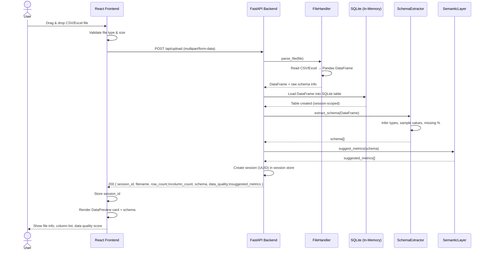
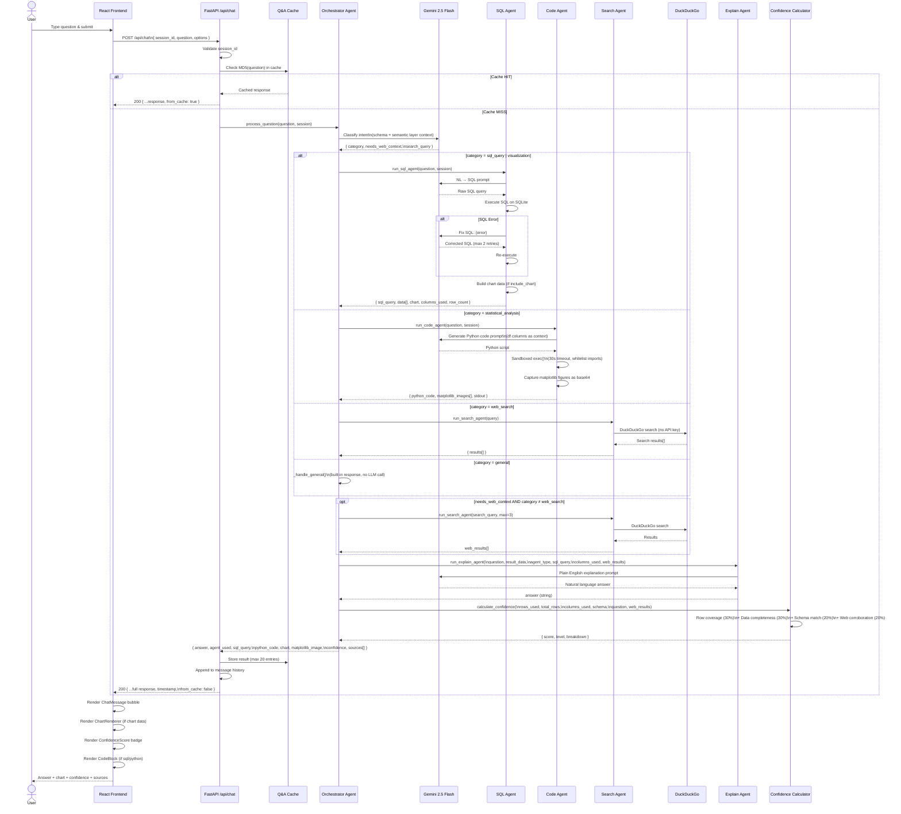
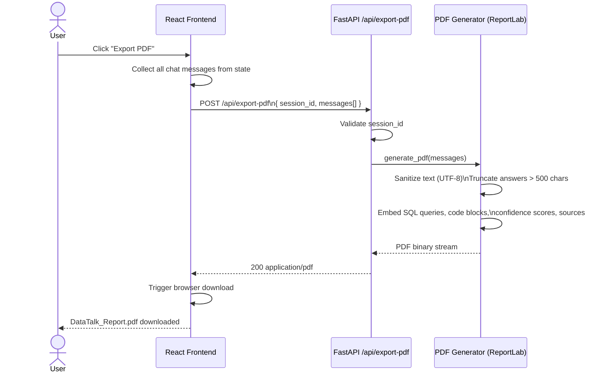
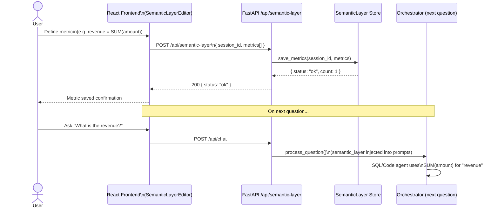

# DataTalk — Sequence Diagrams

## 1. File Upload Flow

```mermaid
sequenceDiagram
    actor User
    participant FE as React Frontend
    participant API as FastAPI Backend
    participant FH as FileHandler
    participant DB as SQLite (In-Memory)
    participant SC as SchemaExtractor
    participant SL as SemanticLayer

    User->>FE: Drag & drop CSV/Excel file
    FE->>FE: Validate file type & size
    FE->>API: POST /api/upload (multipart/form-data)
    API->>FH: parse_file(file)
    FH->>FH: Read CSV/Excel → Pandas DataFrame
    FH-->>API: DataFrame + raw schema info

    API->>DB: Load DataFrame into SQLite table
    DB-->>API: Table created (session-scoped)

    API->>SC: extract_schema(DataFrame)
    SC->>SC: Infer types, sample values, missing %
    SC-->>API: schema[]

    API->>SL: suggest_metrics(schema)
    SL-->>API: suggested_metrics[]

    API->>API: Create session (UUID) in session store
    API-->>FE: 200 { session_id, filename, row_count,\ncolumn_count, schema, data_quality,\nsuggested_metrics }

    FE->>FE: Store session_id
    FE->>FE: Render DataPreview card + schema
    FE-->>User: Show file info, column list, data quality score
```

---

## 2. Chat Question Flow (Full Pipeline)

```mermaid
sequenceDiagram
    actor User
    participant FE as React Frontend
    participant API as FastAPI /api/chat
    participant Cache as Q&A Cache
    participant Orch as Orchestrator Agent
    participant Gemini as Gemini 2.5 Flash
    participant SQL as SQL Agent
    participant Code as Code Agent
    participant Search as Search Agent
    participant DDG as DuckDuckGo
    participant Explain as Explain Agent
    participant Conf as Confidence Calculator

    User->>FE: Type question & submit
    FE->>API: POST /api/chat\n{ session_id, question, options }

    API->>API: Validate session_id
    API->>Cache: Check MD5(question) in cache

    alt Cache HIT
        Cache-->>API: Cached response
        API-->>FE: 200 { ...response, from_cache: true }
    else Cache MISS
        API->>Orch: process_question(question, session)

        %% Step 1: Classify
        Orch->>Gemini: Classify intent\n(schema + semantic layer context)
        Gemini-->>Orch: { category, needs_web_context,\nsearch_query }

        %% Step 2: Route to specialist agent
        alt category = sql_query | visualization
            Orch->>SQL: run_sql_agent(question, session)
            SQL->>Gemini: NL → SQL prompt
            Gemini-->>SQL: Raw SQL query
            SQL->>SQL: Execute SQL on SQLite
            alt SQL Error
                SQL->>Gemini: Fix SQL: {error}
                Gemini-->>SQL: Corrected SQL (max 2 retries)
                SQL->>SQL: Re-execute
            end
            SQL->>SQL: Build chart data (if include_chart)
            SQL-->>Orch: { sql_query, data[], chart, columns_used, row_count }

        else category = statistical_analysis
            Orch->>Code: run_code_agent(question, session)
            Code->>Gemini: Generate Python code prompt\n(df columns as context)
            Gemini-->>Code: Python script
            Code->>Code: Sandboxed exec()\n(30s timeout, whitelist imports)
            Code->>Code: Capture matplotlib figures as base64
            Code-->>Orch: { python_code, matplotlib_images[], stdout }

        else category = web_search
            Orch->>Search: run_search_agent(query)
            Search->>DDG: DuckDuckGo search (no API key)
            DDG-->>Search: Search results[]
            Search-->>Orch: { results[] }

        else category = general
            Orch->>Orch: _handle_general()\n(built-in response, no LLM call)
        end

        %% Step 3: Optional supplemental web context
        opt needs_web_context AND category ≠ web_search
            Orch->>Search: run_search_agent(search_query, max=3)
            Search->>DDG: DuckDuckGo search
            DDG-->>Search: Results
            Search-->>Orch: web_results[]
        end

        %% Step 4: Explain Agent
        Orch->>Explain: run_explain_agent(\nquestion, result_data,\nagent_type, sql_query,\ncolumns_used, web_results)
        Explain->>Gemini: Plain English explanation prompt
        Gemini-->>Explain: Natural language answer
        Explain-->>Orch: answer (string)

        %% Step 5: Confidence Score
        Orch->>Conf: calculate_confidence(\nrows_used, total_rows,\ncolumns_used, schema,\nquestion, web_results)
        Conf->>Conf: Row coverage (30%)\n+ Data completeness (30%)\n+ Schema match (20%)\n+ Web corroboration (20%)
        Conf-->>Orch: { score, level, breakdown }

        %% Step 6: Assemble response
        Orch-->>API: { answer, agent_used, sql_query,\npython_code, chart, matplotlib_image,\nconfidence, sources[] }

        API->>Cache: Store result (max 20 entries)
        API->>API: Append to message history
        API-->>FE: 200 { ...full response, timestamp,\nfrom_cache: false }
    end

    FE->>FE: Render ChatMessage bubble
    FE->>FE: Render ChartRenderer (if chart data)
    FE->>FE: Render ConfidenceScore badge
    FE->>FE: Render CodeBlock (if sql/python)
    FE-->>User: Answer + chart + confidence + sources
```

---

## 3. Export PDF Flow

```mermaid
sequenceDiagram
    actor User
    participant FE as React Frontend
    participant API as FastAPI /api/export-pdf
    participant PDF as PDF Generator (ReportLab)

    User->>FE: Click "Export PDF"
    FE->>FE: Collect all chat messages from state
    FE->>API: POST /api/export-pdf\n{ session_id, messages[] }

    API->>API: Validate session_id
    API->>PDF: generate_pdf(messages)
    PDF->>PDF: Sanitize text (UTF-8)\nTruncate answers > 500 chars
    PDF->>PDF: Embed SQL queries, code blocks,\nconfidence scores, sources
    PDF-->>API: PDF binary stream

    API-->>FE: 200 application/pdf
    FE->>FE: Trigger browser download
    FE-->>User: DataTalk_Report.pdf downloaded
```

---

## 4. Semantic Layer Flow

```mermaid
sequenceDiagram
    actor User
    participant FE as React Frontend\n(SemanticLayerEditor)
    participant API as FastAPI /api/semantic-layer
    participant SL as SemanticLayer Store
    participant Orch as Orchestrator (next question)

    User->>FE: Define metric\n(e.g. revenue = SUM(amount))
    FE->>API: POST /api/semantic-layer\n{ session_id, metrics[] }
    API->>SL: save_metrics(session_id, metrics)
    SL-->>API: { status: "ok", count: 1 }
    API-->>FE: 200 { status: "ok" }
    FE-->>User: Metric saved confirmation

    Note over FE,Orch: On next question...
    User->>FE: Ask "What is the revenue?"
    FE->>API: POST /api/chat
    API->>Orch: process_question()\n(semantic_layer injected into prompts)
    Orch->>Orch: SQL/Code agent uses\nSUM(amount) for "revenue"
```
